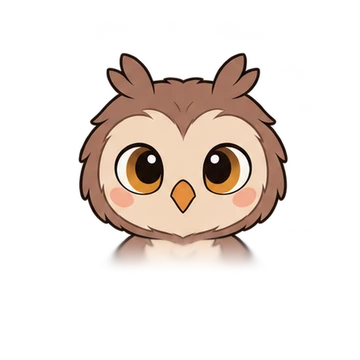
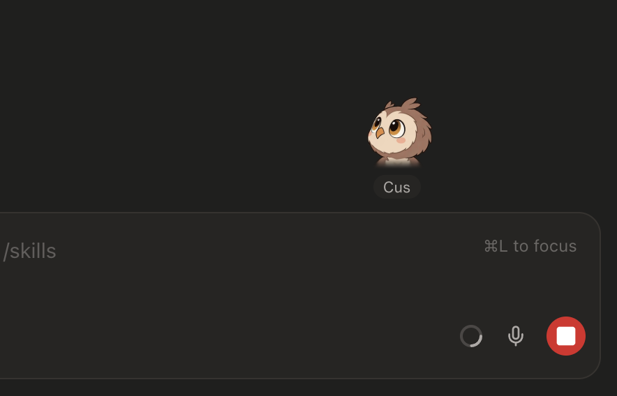
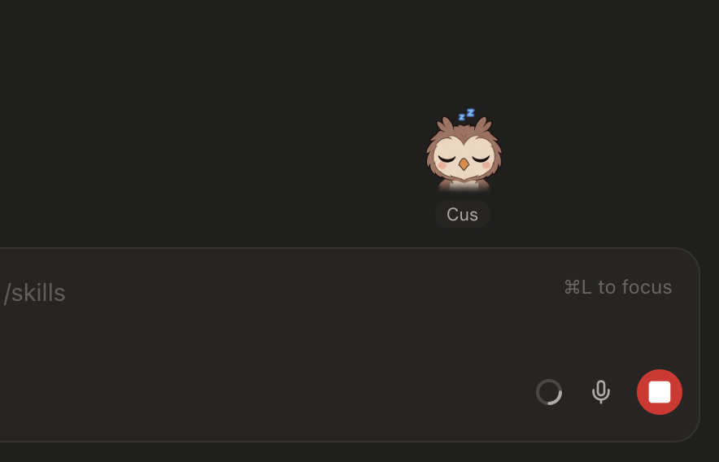
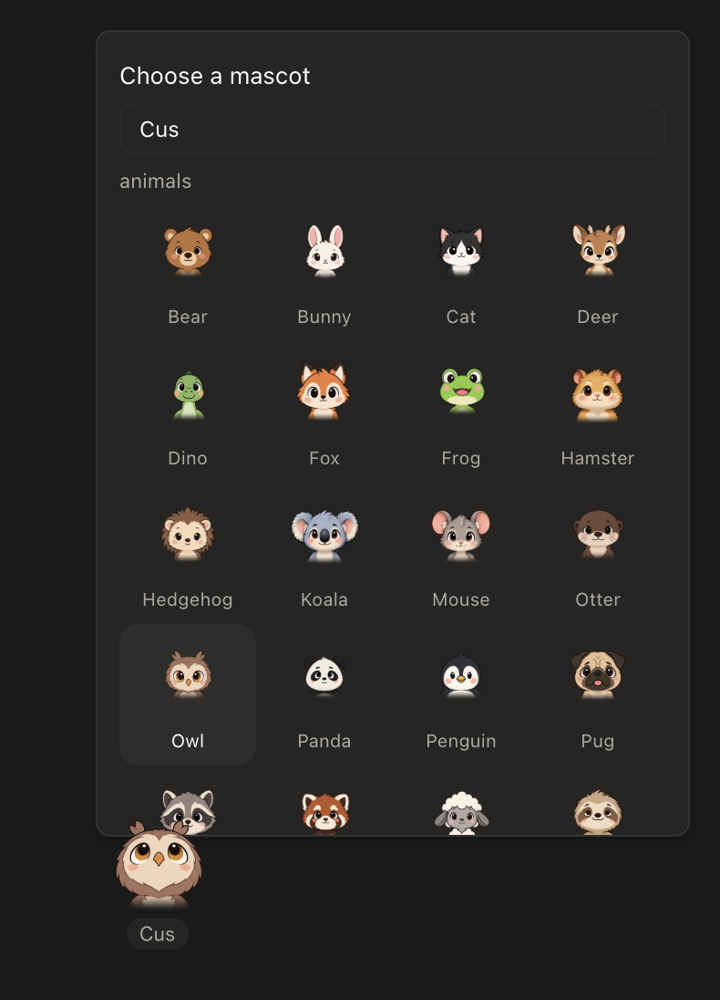

<p align="center">
  
</p>

# paseo-mascot

A pet for your [Paseo](https://paseo.sh) composer. Pick one of 58 characters from
[koboyo's page-mascot](https://koboyo.com/page-mascot) catalogue and it perches on the
chat box, watches what you're doing, naps when you leave, and reacts when you poke it.

Desktop only — it perches on the host's DOM, and the mobile app has none.

---

## ⭐ Showcase

| | |
|:---:|:---:|
|  |  |
| Perched on the chat box, watching the cursor | Left alone for 10s — asleep until you're back |
|  | |
| Right click: 58 characters and a name tag | |

---

## 📦 Install

```bash
paseo plugin add sting8k/paseo-mascot
```

Then open Command Center and run **Mascot: add a mascot to this composer**.
`paseo plugin update paseo-mascot` pulls new versions.

---

## 🐾 Using it

| Do | Gets |
| --- | --- |
| Right click | picker: choose a character, give it a name |
| Left click | poke — `heart` / `sparkle` / `delighted` in turn; four fast pokes → `dizzy` |
| Drag | carry it anywhere; the spot is remembered. Drop it back near the chat box and it climbs on |
| Drag far (≥ 240px) | lands `dizzy`; a short move lands `bashful` |
| Park the cursor on it 2s | `bashful` |
| Leave it 10s | falls asleep; wakes `surprised` when you move or type |

On its own it watches the chat box while you type, glances at the transcript while an
agent runs, notices the cursor only when it darts or moves somewhere new (and loses
interest after a moment), blinks, and now and then pulls a face for no reason.

Workspace status shows too: `sparkle` when a run starts, `delighted` when it finishes
(held until you come back), `surprised` when it needs you, `dizzy` when it fails.

---

## 🛠️ Development

```bash
npm install
npm run typecheck
paseo plugin reload paseo-mascot   # hot-swaps the plugin in the running daemon
```

---

## 🙏 Credits

Characters, sprite sheets and the original cursor-following behaviour are from
[page-mascot](https://github.com/nilbuild/page-mascot) by Kamran Ahmed (MIT), served
from [koboyo.com](https://koboyo.com/page-mascot).

## 📄 License

[MIT](LICENSE)
